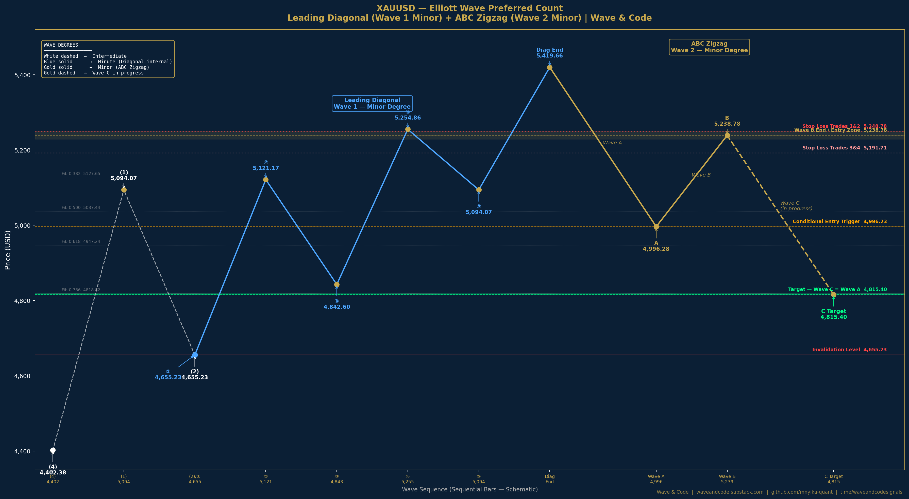

# XAUUSD Elliott Wave Backtest — Preferred Count
### Leading Diagonal (Wave 1 Minor) + ABC Zigzag Short (Wave 2 Minor)

[](https://colab.research.google.com/github/mnyika-quant/xauusd-elliott-wave-backtest/blob/main/XAUUSD_Elliott_Wave_Backtest_Preferred_Count.ipynb)


**By Munyaradzi Nyika | Wave & Code**

📊 Research: [waveandcode.substack.com](https://waveandcode.substack.com)
💻 Code: [github.com/mnyika-quant](https://github.com/mnyika-quant)
📡 Live Signals: [t.me/waveandcodesignals](https://t.me/waveandcodesignals)

---

## Overview

This repository documents a systematic short trade framework built on Elliott Wave
structure and RSI momentum confirmation applied to XAUUSD (Gold) on the 4 Hour timeframe.

Most analysts use Elliott Wave as a subjective art. This project uses it as a
structured rules-based framework — where a wave count becomes a testable hypothesis
and every trade idea is validated by code before capital is committed.

The trade **closed successfully on 16 March 2026** with a 
**32.37% return in 5 days** on a $100,000 simulated account. 
Full analysis documented on Substack.


---

## Wave Structure — Annotated Chart



---

## Wave Structure Summary

### Context — Intermediate Degree (White Labels)

| Point | Price |
|-------|-------|
| Wave 4 Low — Foundation | 4,402.38 |
| Wave 1 Up | 5,094.07 |
| Wave 2 Down — Diagonal Start | 4,655.23 |

### Leading Diagonal — Minute Degree (Blue Labels)
*Labelled as Wave 1 of Minor Degree*

| Wave | Start | End |
|------|-------|-----|
| Wave 1 | 4,655.23 | 5,121.167 |
| Wave 2 | 5,121.167 | 4,842.60 |
| Wave 3 | 4,842.60 | 5,254.86 |
| Wave 4 | 5,254.86 | 5,094.07 |
| Wave 5 | 5,094.07 | **5,419.66 — Diagonal Complete** |

### ABC Zigzag — Minor Degree (Yellow Labels)
*Labelled as Wave 2 of Minor Degree*

| Wave | Start | End | Status |
|------|-------|-----|--------|
| Wave A | 5,419.66 | 4,996.28 | Complete |
| Wave B | 4,996.28 | 5,238.78 | Complete — 10 March 2026 |
| Wave C | 5,238.78 | 4,815.40 | **In Progress** |

---

## Fibonacci Confluence

The target of **4,815.40** sits just below the **0.786 Fibonacci retracement**
of the entire leading diagonal at **4,818.78**.

| Fibonacci Level | Calculation | Price |
|----------------|-------------|-------|
| Diagonal Range | 5,419.66 − 4,655.23 | 764.43 pts |
| 0.382 retracement | 5,419.66 − (764.43 × 0.382) | 5,127.42 |
| 0.500 retracement | 5,419.66 − (764.43 × 0.500) | 5,037.45 |
| 0.618 retracement | 5,419.66 − (764.43 × 0.618) | 4,947.53 |
| **0.786 retracement** | 5,419.66 − (764.43 × 0.786) | **4,818.78** |
| **Wave C = Wave A** | 5,238.78 − 423.38 | **4,815.40** |

When Wave C equality and a Fibonacci retracement level coincide at the same
price zone that is called **confluence** — one of the most reliable target
identification tools in Elliott Wave analysis.

---

## Trade Framework

| Parameter | Value |
|-----------|-------|
| Direction | SHORT |
| Timeframe | 4 Hour |
| Capital | $100,000 |
| Entry Trigger | RSI crosses below RSI MA after Wave B completes |
| Entry Date | 11 March 2026 |
| Entry Price | 5,140.00 |
| Trades 1 & 2 Size | 1.0 lot each |
| Stop Loss Trades 1 & 2 | 5,248.78 |
| Conditional Entry Trigger | Price breaks below 4,996.23 |
| Trades 3 & 4 Size | 1.0 lot each |
| Stop Loss Trades 3 & 4 | 5,191.71 |
| Break Even | Trades 1 & 2 moved to break even when Trades 3 & 4 trigger |
| Primary Target | 4,815.40 (Wave C = Wave A) |
| Early Exit | RSI crosses above RSI MA |
| Invalidation | 4,655.23 — break below invalidates the diagonal |

---

## Risk to Reward

| Metric | Value |
|--------|-------|
| Entry Price | 5,140.00 |
| Stop Loss | 5,248.78 |
| Risk | 108.78 points |
| Target | 4,815.40 |
| Reward | 324.60 points |
| **Risk to Reward** | **1 : 2.98** |

---

## Signal Logic

### Why a Leading Diagonal Matters

A leading diagonal is a five wave structure with overlapping waves — waves 1 and 4
overlap which would be invalid in a standard impulse wave. It appears in the Wave 1
position and signals that the move following it will be sharp and corrective.

The ABC zigzag that follows a leading diagonal typically retraces **0.618 to 0.786**
of the entire diagonal. Our Wave C target of 4,815.40 sits just below the 0.786
retracement — consistent with the expectation for a deep corrective zigzag.

### Dual Confirmation Entry

Two independent conditions must fire simultaneously before capital is committed:

1. **Elliott Wave structural trigger** — price below Wave B high at 5,238.78
2. **RSI momentum confirmation** — RSI (14) crosses below its 14 period MA

This dual confirmation reduces false entries and only commits capital when both
structure and momentum align.

### Position Scaling

The strategy scales into the position as the trade proves itself:

- Initial 2 lots at RSI signal — controlled initial risk
- Additional 2 lots when price breaks below 4,996.23 — adds size after confirmation
- Stops on initial lots moved to break even at that point
- Worst case after scaling: **zero loss on initial position** even if trade reverses

---

## Data Source

```python
# GC=F Gold Futures via yfinance
# 1H bars downloaded and resampled to 4H
# Price range covers all wave levels: 4,402 to 5,602

raw = yf.download('GC=F', start='2024-11-01', end='2026-03-13',
                  interval='1h', auto_adjust=True)
gold = raw.resample('4h').agg({
    'Open': 'first', 'High': 'max',
    'Low': 'min', 'Close': 'last', 'Volume': 'sum'
}).dropna()
```

---

## Performance Metrics — TRADE CLOSED ✅

| Metric | Value |
|--------|-------|
| Entry Date | 11 March 2026 |
| Entry Price | 5,140.00 |
| Exit Date | 16 March 2026 |
| Exit Price | 4,978.13 |
| Status | **CLOSED — TARGET ACHIEVED** |
| Points Captured | 161.87 |
| Trade Duration | 5 Days |
| Profit Locked | $32,374 |
| Return on $100,000 | **32.37%** |
| Max Drawdown | -3.69% |
| Risk to Reward Achieved | 1 : 1.49 |
| Version | 2.0 — Partial exit at Wave C = 0.618 Wave A |


---

## Repository Structure

```
xauusd-elliott-wave-backtest/
│
├── xauusd_elliott_wave_backtest.ipynb  — Full backtest notebook
├── XAUUSD_Static_Wave_Chart.png        — Annotated wave count chart
├── README.md                           — This file
└── trade_log.csv                       — Trade execution log
```

---

## How to Run

### Option 1 — Google Colab (Recommended)
Click the **Open in Colab** badge at the top of this README.
All dependencies install automatically in the first cell.

### Option 2 — Local
```bash
git clone https://github.com/mnyika-quant/xauusd-elliott-wave-backtest
cd xauusd-elliott-wave-backtest
pip install yfinance pandas numpy matplotlib
jupyter notebook xauusd_elliott_wave_backtest.ipynb
```

---

## Alternative Count

A full alternative count analysis is in development and will be published
on Wave & Code documenting the scenario under which this preferred count
is invalidated and the trade framework adapts accordingly.

---

## Next Development

- Alternative count backtest
- XAUUSD Version 2 with ATR based dynamic position sizing
- JSE Top 40 Elliott Wave backtest — Wave & Code Africa series

---

## Related Work

- [BTCUSD Elliott Wave WXY Double Zigzag Backtest](https://github.com/mnyika-quant/btc-usd-elliott-wave-backtest)
- [Full Analysis on Wave & Code](https://waveandcode.substack.com)

---

## Disclaimer

This repository is for educational and research purposes only.
It documents a systematic trading framework and does not constitute
financial advice. All trading involves risk. Past performance does
not guarantee future results.

---

*Wave & Code — where Elliott Wave structure meets systematic execution*
*waveandcode.substack.com | github.com/mnyika-quant | t.me/waveandcodesignals*
